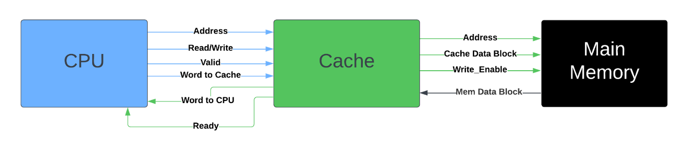
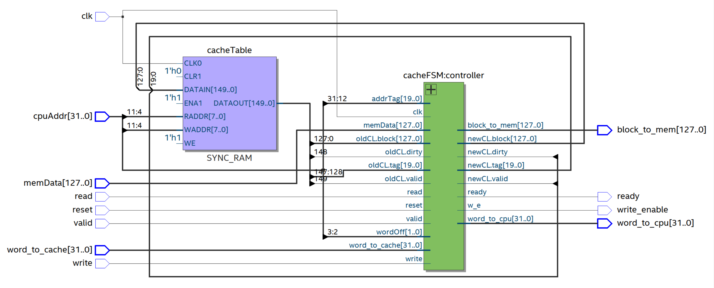
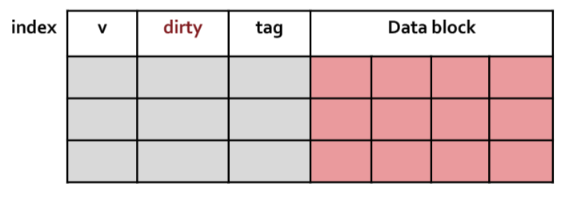
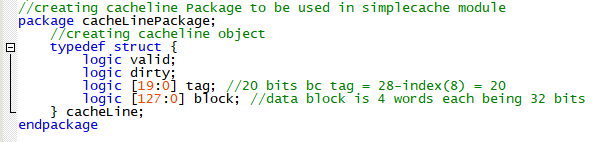
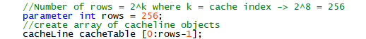
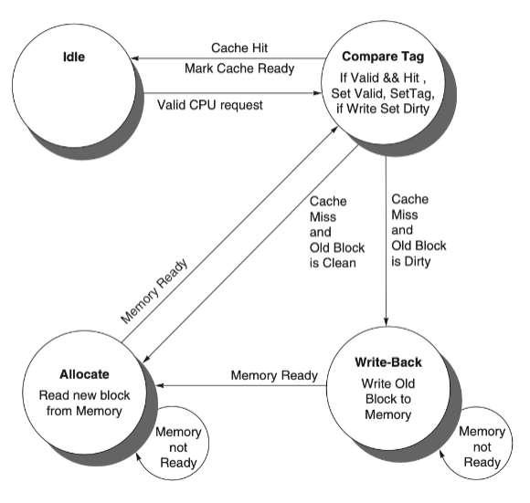
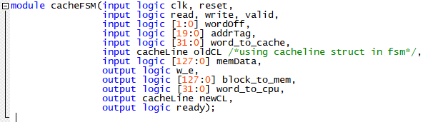
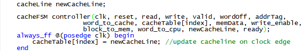
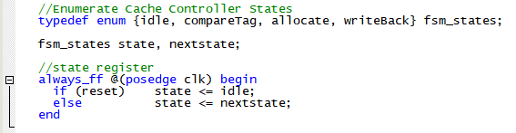

Advanced Computer Architecture: Processor Design

Abdoula Barry

01/21/2024

## Simple Cache
Design of a Uni-level Direct Mapped Cache
### Section 1: Cache Organization

 
  

<em>Figure 1: Top Level Design and Signal Interface</em>

The top-level design as shown in figure 1 illustrates the overall
structure of the cache with respect to the signals flowing into and out
of it. To keep things simple and focused, the CPU is not actually
described as a module but is instead modeled in the testbench by the
signals it sends to the cache unit. The memory unit, however, is
described as an actual module with data.

**1.2: Design Parameters**

Signals:

-   32-bit Address -- Location: used to get the tag, index, and offset
    values to point to cache lines and data.

-   1-bit Read/Write -- Read data from cache/main-memory (on a miss) or
    write data to cache.

-   1-bit Valid -- Cache needs a 'Valid' high from CPU to execute.

-   32-bit Word-to-Cache -- On a read request, this is the word sent to
    CPU from cache.

-   32-bit Word-to-CPU -- On a write request, this is the word to be
    written to the cache

-   1-bit Ready -- Tells the CPU cache operation is complete.

-   128-bit Cache Data Block -- Sent to main memory on a write-back.

-   1-bit Write Enable -- Enables writing in main memory during
    write-back.

-   128-bit Mem Data Block -- Sent to the cache from main memory during
    an allocate.

Design Parameters:

-   Direct-mapped cache

-   Write-back using write allocate

-   Block size: 4 words (16 bytes / 128 bits)

-   Cache size: 256 blocks in total

-   The cache includes a valid bit and dirty bit per block

-   Byte offset: 2 bits

-   Block offset: 2 bits

-   Cache index: 8 bits

-   Tag size: 20 bits = 32 - (8+2+2)

-   Non-blocking

### Section 2: Description of cache components and basic operations

 
  

<em>Figure 2: RTL View of CacheTable and Controller</em>

Figure 2 shows the top-level hierarchy of my design. As you can see, I
have a Cache Table or unit properly created. To design my cache unit, I
created a package in system Verilog shown in figure 4 below that
essentially represents the basic structure of a cache line for a
direct-mapped cache that uses write-back. This basic structure is shown
in figure 3.

 
  

<em>Figure 3: Write-back Cache Microarchitecture (taken from lecture notes)</em>

 
  

<em>Figure 4: Cache Line and Package struct</em>

By creating a package of the cache line, I was able to import this
package into my actual cache design and create an array of these cache
line objects that essentially represented my cache table. This is seen
in figure 5 below.

 
  

<em>Figure 5: Cache Table Creation</em>

Furthermore, the cache module naturally parses the 32-bit Address sent
by the CPU into the tag, index, and offset registers respectively. The
cache Table uses these registers to access a specific cache line and
32-bit word in the cache line data block. Basically, based on the
address, the cache unit feeds the respective cache line into the cache
controller. The controller will then use this cache line and some other
inputs such as whether the CPU issues a read/write to perform operations
on the cache line such as setting the tag or valid fields or grabbing a
word from the data block.

### Section 3: Cache Controller

 
  

<em>Figure 6: FSM Controller for Simple Cache</em>

The cache controller is a finite state machine that follows the above
figure 6 very closely. As further detailed in figure 2 and touched on in
the previous section, the cache controller performs all of the necessary
updates to a cache line based on the signals being fed to it from the
CPU. Upon seeing a valid CPU request, the controller will look at the
cache line the address points to and will enter the compare Tag state
where it will check for a cache hit or miss. If there is a cache hit,
there is no need to enter the following write-back and allocate states
and the controller will issue the read/write action and send a high
ready signal to the CPU. This lets the CPU know the cache operation is
complete. On a cache miss, there are further decisions to be made that
are realized in the write-back and allocate states. Concurrently, as the
controller moves from state to state, it must set the fields of the
current cache line accordingly. As an example, on the first write to a
cache line, the controller must set the dirty bit to 1 and invalidate
this cache line the next time it's addressed. This will let the cache
know to enter the write-back state where the dirty cache block will be
written to memory and then a new block will be allocated from main
memory into the cache.

 
  

<em>Figure 7: Cache Controller module</em>

Figure 7 shows the inputs and outputs for the controller. One important
thing to note is the input 'oldCL' and the output 'newCL'. As mentioned
before, the cache Line looks at every cache line as it currently is and
updates it accordingly based on the current address. This update is sent
as output in a new cache line that is then assigned to the proper spot
in the cache table on the positive clock edge. This is shown in figure 8
below.

 
  

<em>Figure 8: Cache Controller instantiation and cache table update logic</em>

More on the actual hardware description, the cache is designed in the
usual style for a FSM meaning there is of course state enumeration, and
a state register (figure 9).

 
  

<em>Figure 9: State enumeration and state register</em>

Following, which I won't show as it would take up too much space, is a
combinational block that describes the transition and output logic. So
that is where all the field setting, accesses to main memory, and output
values such as the word to send to the CPU is set.

##

Following this, please navigate to the \src\ folder to find the full rtl design, tesbench, and simulation results. Computer Architecture is super interesting to me so this was a fun project to gain a better understanding of caching and memory interfaces. 

Thanks for reading :)
