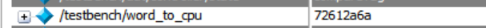

## Test Cases and Simulation results

1.  **Section 1: Test Bench Description**

2.  **Section 2: Case 1 -- Read miss**

3.  **Section 3: Case 2 -- Write miss**

4.  **Section 4: Case 3 -- Read hit**

5.  **Section 5: Case 4 -- Write Back**

### Section 1: Test Bench Description

The test bench is designed such that it of course initializes all of the
signals and also creates the inputs and outputs to all the modules and
the device-under-test (DUT). Figure 10 shows the setup for the following
test cases.

 
  

<em>Figure 1: Test Bench Initialization</em>

To elaborate; memData is the 128-bit data block from main memory;
block_to_mem is the 128-bit data block written to main memory during a
write-back; word_to_cache only has a value when the CPU is writing a
word; word_to_cpu only has a value when the CPU issues a read.
Everything else, I hope, is clear.

I designed my testbench to instantiate a memory unit and later fill it
with data set to known addresses so I can properly test my design. Now
on to the test cases.

### Section 2: Case 1 - Read miss

Expected Steps/Behavior:

-Cache should see the read, compulsory miss in compareTag state

-Enter Allocate state as the dirty bit is low

-Bring memData at the address into the cache line

-Return to compareTag and get a hit

-Word_to_cpu should be set based on the word offset

-Should go to Idle and ready signal set high

BEGIN

 
  

IDLE state -- the ready signal is 1 and as you can see the cache line is
empty. Ignore that Address field and memData field above.

 
  

Process of read-miss which matches the expected behavior

Going from top down of this image: The read signal goes high, the write
signal is low, and the valid signal from the CPU goes high. Next, we see
the address which is set to 'a4ff945d'. Below is the memory block
associated with that address. In the compare tag state, the controller
sets the tag field of the cache line to the upper 20 bits of the address
and there is a compulsory miss:

 
  

The dirty bit is low, so the controller goes to the allocate state to
read the new block from memory. The '11' is the word offset from the
address. The block is then loaded into the cache:

Cache Line: 
 
  

The controller goes back to the compareTag state, gets a hit because the
data has been loaded and then finally issues the read operation which
sets the word_to_cpu to be the least significant word in the data block
as the word offset is 11. This is just how I've designed it in my cache.
If the word offset was 00, the associated word would be the most
significant one in the data block:

 
  

 
  

The controller then goes back to the idle state and sets the ready
signal high:

 
  

The top is the ready signal.

**This means the Cache is working as expected for this first case and
verifies READ MISS and READ HIT FUNCTIONALITY.**

### Section 3: Case 2 - Write miss

Expected Steps/Behavior:

-Cache should see the write, compulsory miss in the compareTag state but
set the dirty bit to high

-Old block is clean here so next is

-Allocate and read the block into memory

-Back to compareTag, get a hit

-word_to_cache should be set to data block based on word offset

-Should go to Idle and set ready high

 
  

IDLE state. Memory address is 'b0a9cb14' and the associated memory data
block is shown underneath it. The valid bit is high, write is high and
read is low so the cache is going into the compareTag state.

 
  

In the compareTag state the dirty bit of the cache line is set to 0
because the bit is to 1 on the first write to the cache line and the tag
field is set again:

 
  

This is a write miss of course so we should allocate a new block from
memory:

 
  

The data in memory is loaded into the cache line and now we go back to
the compareTag state to write the word from the cpu into the cache line.
The word from the cpu is circled in black above:

 
  

As you can see, the word '0721264e' is written to the area corresponding
to the offset which is 01. You will also notice the valid bit has been
set low and the dirty bit for this cache line is high. This is
highlighted in black in the image above. Finally, the controller goes
back to the idle state:

 
  

**This means the Cache is working as expected for this case and verifies
WRITE MISS and WRITE HIT FUNCTIONALITY.**

### Section 4: Case 3 -- Read hit

This test case will just demonstrate again the functionality of a read
hit, although this has technically already been seen to be working in
the first test case. I wanted to just verify the cache controller could
see a hit and then just go back to the idle state after setting the
cache line and output values.

Expected Steps/Behavior:

-Cache sees the read, hits in compareTag

-Sets word_to_cpu based on word offset and goes back to Idle

-Ready set high

 
  

 
  

IDLE state and cpu issues a read to a cache line that has the data
already. You might notice this is the same address I just wrote to in
the previous test case.

 
  

The controller sees the read request and enters the compareTag state and
sees the data is readily available. So, the word_to_cpu is set to the
correct word from the data block based on the word offset which is '11'
in this case. This corresponds to the least significant word in the data
block. Then the cache goes back to idle and sets the ready signal to
high.

**This means the Cache is working as expected for this case and verifies
basic HIT FUNCTIONALITY.**

### Section 5: Case 4 -- Write Back

The purpose of this test case is to demonstrate the cache controller's
ability to write a dirty block to memory on a cache miss.

Expected Steps/Behavior:

-Cache sees the read on dirty data

-Go to writeBack state and write dirty data to memory

-Allocate new block from memory

-CompareTag state should set dirty bit back to 0 on read or remain 1 on
write

-CompareTag should set data back to valid

-Go to Idle state, set ready high

 
  

IDLE state: CPU issues a read on a address that points to dirty data.

 
  

The controller enters the compareTag state and sees a miss with dirty
data so the next state is write Back where the current cache line's data
block will be loaded into main memory:

 
  

As you can see, block_to_mem is set to the data block of the cache line,
and this is output to main memory.

We then go to the allocate state and load a new block from memory into
the cache line:

 
  

Now the controller goes back to the compare tag state and sets the
word_to_cpu according to the offset:

 
  

In this case though, the word offset of '01' maps to a 32-bit word of
all 0 so the word_to_cpu is just 0. Again, this is just how I mapped the
word offsets to the words in the data block. I've already shown this
word_to_cpu being set in test case 1.

 
  

Finally, the state goes back to idle, and the ready signal is set high.

**This means the Cache is working as expected for this case and verifies
basic WRITE BACK FUNCTIONALITY.**

Based on these test cases, I have concluded that my direct mapped cache
is functional/operational. Of course there are more improvements that can be made but I'm treating this more as a proof of concept for now before diving into more complicated designs. Thank you for reading and I hope everything or at least most of it was clear.
